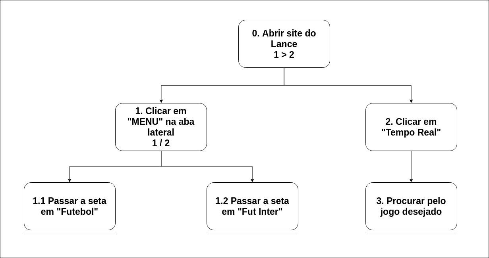

# Análise de Tarefas

## 1. Introdução

A análise de tarefas é um procedimento realizado com o objetivo de decompor uma tarefa complexa em seus componentes mais simples. Trata-se da análise de como uma tarefa é realizada, incluindo uma ou mais das informações a seguir: descrição detalhada tanto de atividades físicas como mentais, duração da tarefa, frequência da tarefa, complexidade da tarefa, condições ambientais, vestimenta e equipamentos necessários.

## 2. Objetivos
#### 2.1 Ver o resultado de jogos
**Diagrama**

**Especificação**

| Objetivos/operações | Problemas e recomendações |
|  :------: | :------: |
| 0. Abrir site do Lance 1 > 2| |
| 1. Clicar em "MENU" na aba lateral 1 / 2| *feedback*: aba lateral modificada para apresentar as opções do menu *problema*: as opções de "TIMES" apresentadas na aba lateral são omitidas *recomendação*: apresentar as opções conforme o usuário selecionar |
| 1.1 Passar a seta em "Futebol"| *feedback*: nova aba responsiva ao *hover* do mouse aparece na tela|
| 1.2 Passar a seta em "Fut Inter"| *feedback*: nova aba responsiva ao *hover* do mouse aparece na tela |
| 2. Clicar em "Tempo Real"| *feedback*: usuário é redirecionado para uma nova aba *problema*: o site abre uma nova aba no navegador para apresentar as informações dos jogos *recomendação*: redirecionar o usuário sem trocar de abas |
| 3. Procurar pelo jogo desejado|||

| Data | Versão | Modificação | Autor |
|  :------: | :------: | :------: | :------: |
| 12/10/2019 | 0.1 | Iniciando documento | Murilo Loiola |
| 12/10/2019 | 0.2 | Adição da análise 1 | Murilo Loiola |
