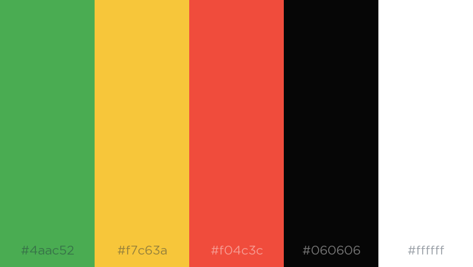
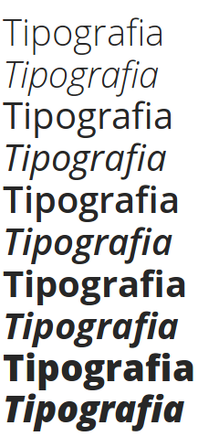

# Guia de estilo

## 1. Introdução

&emsp;&emsp;Lance é um site de notícias focado em conteúdo esportivo no país, oferecendo conteúdo de interesse do torcedor e do esporte nacional. 

## 2. Logo

&emsp;&emsp;A logotipo do Lance apresenta o escudo de um clube de futebol. As cores verde e amarela remetem as cores da bandeira do Brasil.

## 3. Paleta de cores

&emsp;&emsp;Para a paleta de cores foram detectadas duas cores principais. Verde #4aac52 para o menu principal e Branco #ffffff para o fundo.

## 4. Tipografia

### 4.1 Alfa Slab One

Utilizada na maioria dos títulos e manchetes.

### 4.2 Open Sans

Utilizada em grande parte dos textos e descrições.

## 5. Resultado de análise

- Layout não é bem definido, embora o grid tenha padronização.
- Interface poluída com uma enorme quantidade de propagandas, que causa desorientação ao usuário.
- Barra de navegação não padronizada, muda em diferentes páginas.
- Ao clicar em alguns links abre uma nova aba.
- Excesso de cores visuais.
