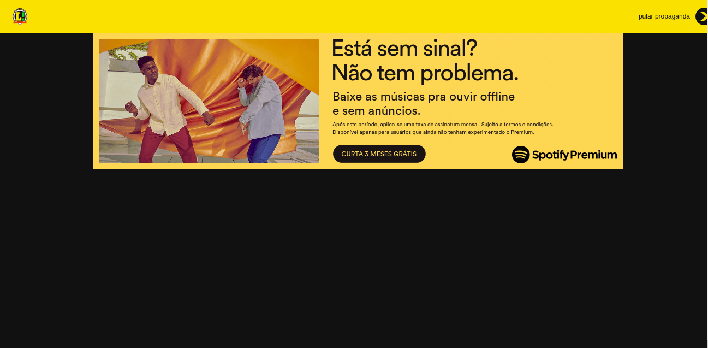
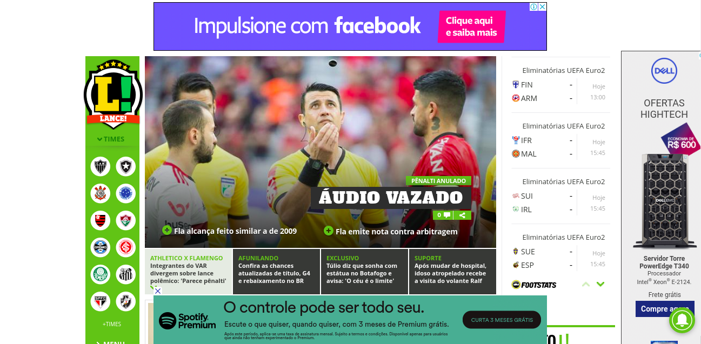

# Características da Plataforma

## Introdução

Este documento tem como objetivo citar quais features e atributos o site do Lance! possui e como cada uma delas interage com o usuário e em sua relação com a boa ou não experiência que elas fornecem. Cada uma das principais características do site estão separadas em dois grupos: Características Positivas ou Características Negativas.

## Objetivo da Plataforma

O site do Lance! tem como principal objetivo noticiar as principais notícias do mundo do esporte como um geral, mas com grande ênfase no futebol nacional. O futebol nacional é tão importante para a plataforma que é o único que possui uma sidebar própria com todos os times que estão na série A do brasileirão. A plataforma também possui recursos para te encaminhar para outros sites próprios de outros esportes.

## Características Positivas

### - Integração com Vídeos

O site possui a própria plataforma de visualização de vídeos para auxiliar o usuário a entender a notícia.

### - Personalização por Time

Cada time que está presente na sidebar principal do site possui sua página com a paleta de cores própria do time.

## Características Negativas

### - Anúncios Exagerados

É notável como o site é cheio de anúncios em todas as páginas que o usuário possui acesso, causando uma enorme poluição visual e afetando de maneira negativa a experiência do usuário.

* Primeira Página ao se acessar o Lance! com anúncio bloqueando todo o conteúdo.

* Página inicial com 3 anúncios ocupando cerca de 20% da tela e atrapalhando a visualização das notícias inferiores.

### - Falta de Coesão

A imagem abaixo demonstra como o site não possui um certo nível de coesão, na qual a parte de cima traz notícias de esporte, toda a lateral continua sendo sobre futebol, mas a parte de baixo ja está com outra temática que possui a própria paleta de cores e sem relação alguma com o resto do conteúdo.

### - Design

Como é de se perceber nas imagens de todo o documento, o site do Lance! não possui um design muito agradável com notícias "jogadas" ao usuário e cheias de anúncios que limitam a visualização de maneira exagerada. Caixas de texto minúsculas que não são agradáveis para leitura.

## Versionamento

| Data | Versão | Modificação | Autor |
| ---- | ------ | ----------- | ----- |
|14/09| 1.0 | Iniciando o Documento | Ian Rocha |