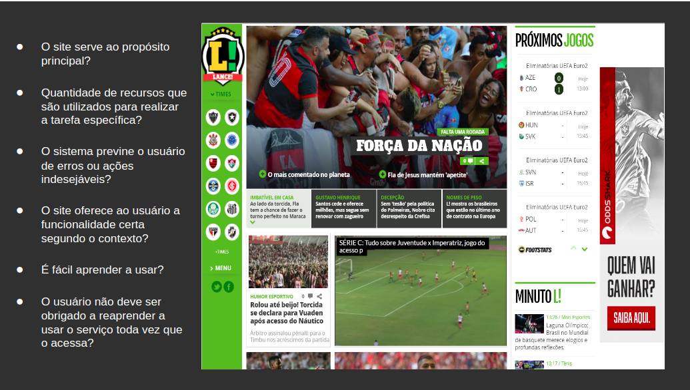

<!-- ## Introdução -->
  Com o propósito de garantir a entrega de um produto de maior qualidade, a avaliação
de IHC faz um julgamento de valor sobre a qualidade de uso da solução de ihc e 
identifica problemas na interação e na interface que prejudiquem a experiência
particular do usuário durante o uso do sistema.

## Planejamento

### Perguntas

### Storyboard

