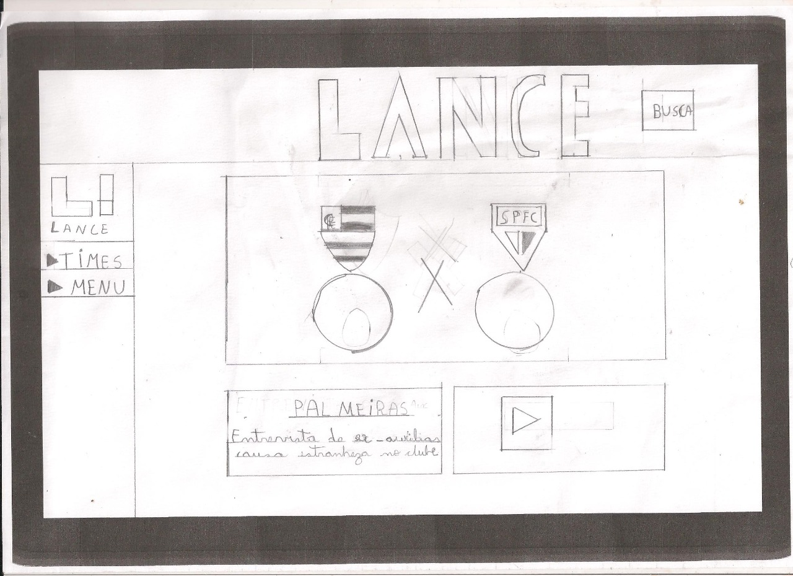
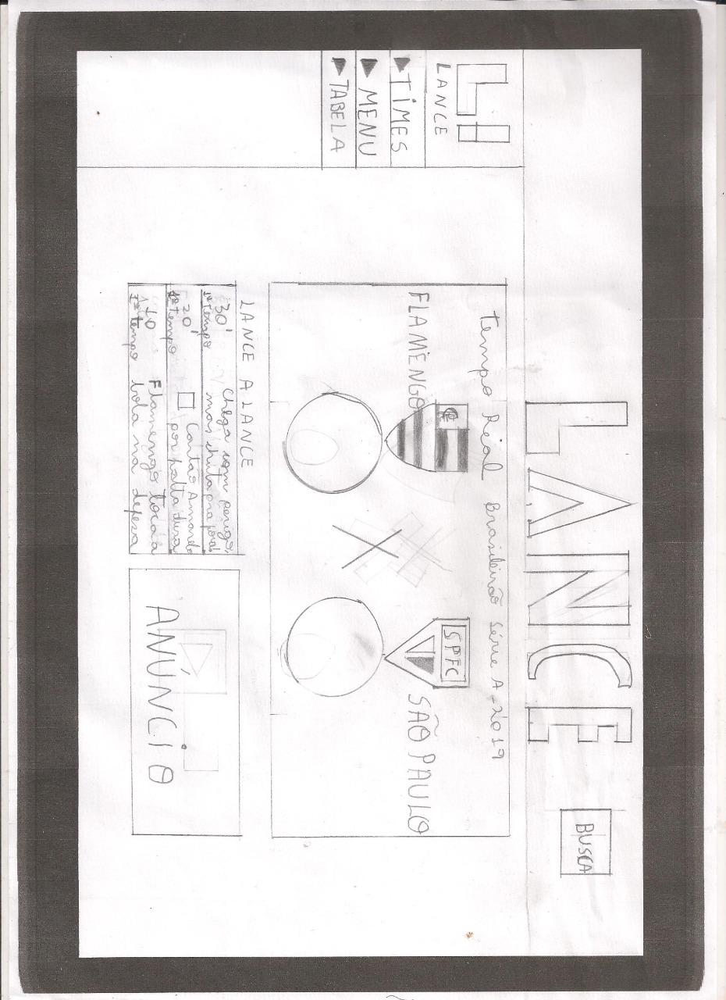

# Protótipo no Papel

<p align="justify">&emsp;&emsp;Método	que	avalia	a	usabilidade de	um	design	de	IHC representado em papel através de simulações de uso com a participação de potenciais usuários, e apresenta vantagens como: </p>

- Rápido de fazer.
- Baixo custo
- Participação dos usuários.

# Como funciona?

<p align = "justify">Usuário:</p>

```bash
Os usuários simulam a execução de tarefas num protótipo em papel, e depois explica sua interação com a aplicação.
```

<p align = "justify">Avaliador ou UX Design:</p>

```bash
Atua como “computador” para simular as resposta da aplicação ao usuário. Além de registrar e avaliar a experiência de usuário na navegação.
```

# Preparação

<p align="justify">&emsp;&emsp;Nessa etapa são construidas algumas telas do site, que possibilita o usuário simular a navegação. </p>

```bash
Nesse caso, simula a funcionalidade do usuário entrar no site e acompanhar os lances de algum jogo em tempo real lance a lance.
```





# Coleta de dados

<p align="justify">Nessa parte o usuário deve executar a tarefa proposta a ele.</p>

## Interpretação

<p align="justify">&emsp;&emsp;O avaliador ou Design UX deve identificar e listar os problemas encontrados. Refinar o protótipo para corrigir os problemas mais simples.</p>

<p align="justify">Problemas relatados pelo usuário.</p>

```bash
Melhorar o tamanho dos cards de notícias.
```

```bash
Melhorar a paleta de cores do site.
```

```bash
Não tirar totalmente os anúncios do site.
```

# Consolidação de resultados

<p align="justify">O avaliador ou Design UX deve:</p>

- Priorizar a correção dos problemas encontrados e não resolvidos.
- Sugerir correções

<p align="justify">&emsp;&emsp;Os problemas citados pelos usuários no protótipo de papel, foram corrigidos no protótipo de alta fidelidade.</p>
